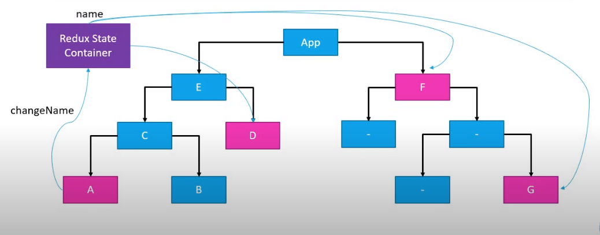
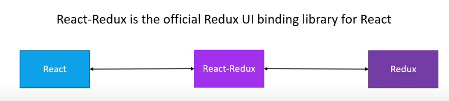
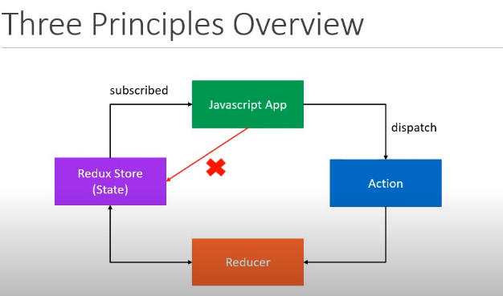

# Redux and React Redux

0. Introduction:

    - ```Redux```:

        - https://redux.js.org/
    
        - ```Redux is a state container```:

            - Redux stores the state of our application.

            - In case of react app - It stores the state of a component.
        
        - ```Redux is predictable```:

            - The state of the application can change.

            - In redux, all state transitions are explicit and it is possible to keep track of them.

            - The changes to your application state's become predictable.

    - ```React Redux```:

        - https://react-redux.js.org/





1. Overview:

    - ```React``` is a library used to buils user interfaces.

    - ```Redux``` is a library for managing state in a predictable way in JavaScript applications

    - ```React-Redux``` is library that provides bindings to use React and Redux together in an application.

2. Understanding Redux:

    - https://redux.js.org/introduction/getting-started

### Redux - ```Three Core Concepts```:

1. ```Store``` - Holds the state of our application.

2. ```Action``` - Dercribes what happened

3. ```Reducer``` - Ties the store and actions together.

- A ```Store``` that holds the state of your application.

- An ```Action``` that describes the changes in the state of the application.

- A ```reducer``` which actually carries out the state transition depending on the action.

### Redux - ```Three fundamental principles```:

1. **The state of your whole application is stored in an object tree within a single store.** 
    - Maintain our application state in a single object which would be managed by the Redux store.

2. **The only way to change the state is to emit an action, an object describing what happened.**
    - To update the state of our app, you need to let Redux know about that with an action.
    - We are not allowed to directly update the state object.

3. **To specify how the state tree is transformed by actions, you write pure reducers.**
    - ```javaScript
        Reducer - (previousState, action) => newState
      ```


### Actions:

- The only way your application can interact with the store.

- Carry some information from your app to the redux store.

- Plain JavaScript objects.

- Have a ```type``` property that indicates the type of action being performed.

- The ```type``` property is typically defined as string constants.

- An action is an ```object``` with a ```type``` property.